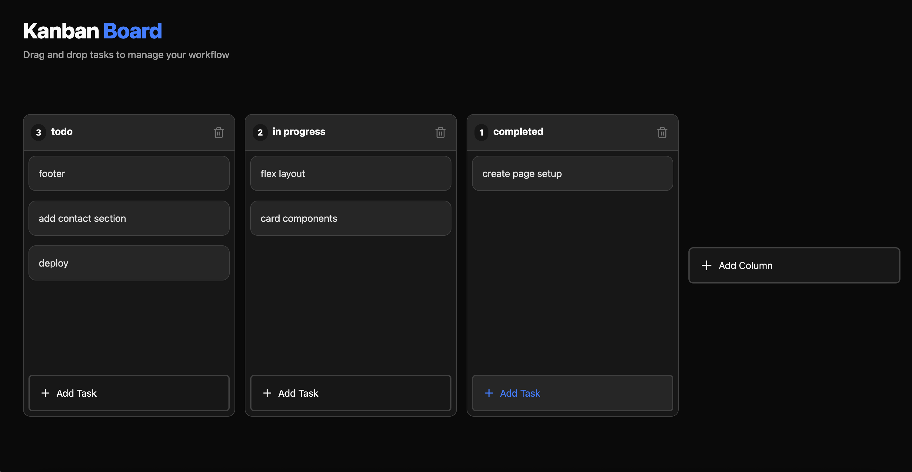

# Modern React Kanban Board

A fully functional, drag-and-drop Kanban board built to showcase modern React development practices.

As a Frontend Engineer with a strong background in Angular, I built this project to demonstrate my flexibility and understanding of the React ecosystem, specifically focusing on React composition, Zustand for shared state, and an unopinionated component architecture.

## 🚀 Live Demo
[View the Live Application Here](https://lenapuletic.github.io/react-kanban/)

## 🛠️ Tech Stack

- **Framework:** React 19 + TypeScript (via Vite)
- **State Management:** Zustand (with localStorage persistence)
- **Styling:** Tailwind CSS v4
- **Drag and Drop:** @dnd-kit (Core & Sortable)
- **Icons:** Lucide React

## 🧠 Key Features & Learnings

- **Complex State Management:** Used Zustand to manage a flat data structure of columns and tasks.
- **Modern Drag-and-Drop:** Implemented `@dnd-kit` Context API, Sensors, and DragOverlay for a buttery-smooth user experience.
- **Data Persistence:** Utilized Zustand's middleware to persist the board state to the browser's local storage.
- **Component Architecture:** Split the UI into focused presentational components, with drag-and-drop orchestration and layout wiring in `App.tsx` and persisted board data in a Zustand store (`boardStore`).
